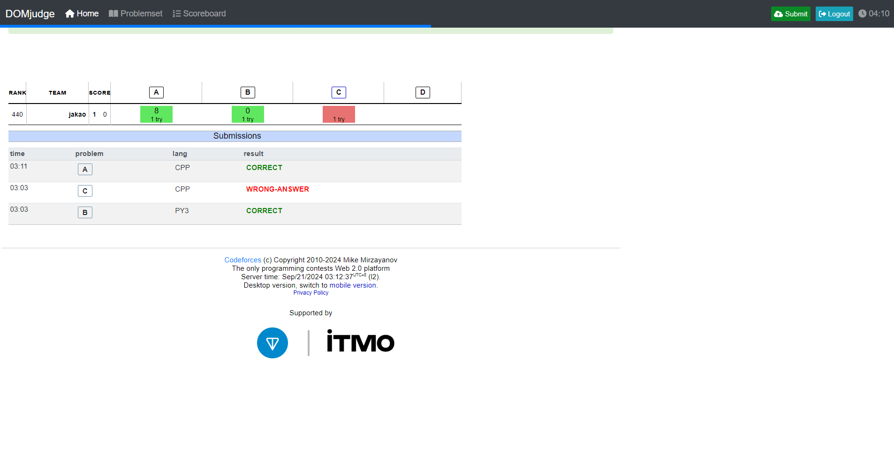
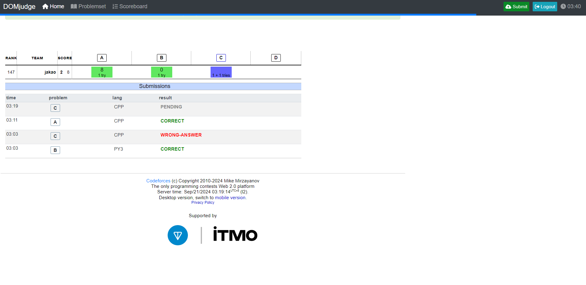

# Domjudge UI for Codeforces

## Introduction

For ICPC competitors practicing for the DOMjudge UI in codeforces.

## Usage

1. Download repo zip.
2. Unzip the folder.
3. Go to the Extensions page by entering chrome://extensions in a new tab. (By design chrome:// URLs are not linkable.)
4. Enable Developer Mode by clicking the toggle switch next to **Developer mode**.
5. Click the Load unpacked button and select the extension directory.

You can also refer to the following [link](https://developer.chrome.com/docs/extensions/get-started/tutorial/hello-world#load-unpacked).

----

